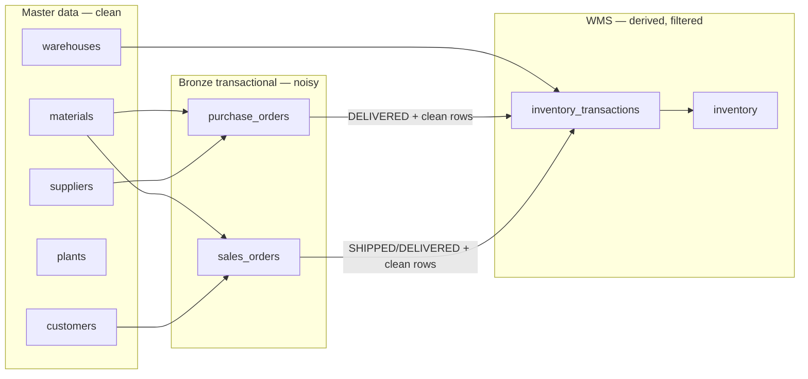

# Data Quality and Noise

This document describes what data the generator produces, where intentional noise is injected, and how that noise propagates (or is filtered out) in downstream tables.

## Pipeline overview



## Write behavior

| Table | Layer | Noise? | DB write mode |
|-------|-------|--------|---------------|
| `materials`, `suppliers`, `customers`, `plants`, `warehouses` | Master | None | Upsert on business key |
| `purchase_orders`, `sales_orders` | Bronze | Yes (~6% row noise + ~1% duplicates) | Append (duplicates allowed) |
| `inventory_transactions` | Bronze | None (derived) | Append |
| `inventory` | Snapshot | None (derived) | Full replace each WMS run |

Bronze order tables use `bronze_row_id` as the primary key. Business IDs (`purchase_order_id`, `sales_order_id`) are **not** unique. Most columns are `TEXT` and nullable so invalid values can be stored intentionally.

Migration `002_order_material_foreign_keys` adds a foreign key from `material_id` → `materials.material_id` when `material_id` is non-null. `NULL` material IDs are still allowed as noise.

---

## Master tables (no noise)

| Table | What it stores | Scale |
|-------|----------------|-------|
| **materials** | Raw materials (`RM####`) and finished goods (`FG####`) | 25 RM + 100 FG |
| **suppliers** | Vendors for raw material purchase orders | 10 |
| **customers** | Buyers of finished goods | 20 |
| **plants** | Manufacturing sites | 2 |
| **warehouses** | 1 raw-material warehouse + 2 finished-goods warehouses | 3 |

Master data is deterministic and clean. Downstream generators treat these tables as the source of truth.

---

## Purchase orders

### Clean base (before noise)

- ~2,000 orders per default run
- Raw materials only (`RM####`)
- Valid suppliers, ISO dates, positive quantities
- Status distribution: ~70% `DELIVERED`, 15% `CONFIRMED`, 10% `CREATED`, 5% `CANCELLED`

### Noise settings

Configured in `generator/config/settings.py` (`NoiseSettings`):

| Setting | Default | Effect |
|---------|---------|--------|
| `enabled` | `true` | Turn all transactional noise on/off |
| `row_noise_rate` | `0.06` | ~6% of rows receive one random defect |
| `duplicate_rate` | `0.01` | ~1% extra rows appended as exact duplicates |

Implementation: `generator/transactional/noise.py` → `apply_purchase_order_noise()`

### Per-row noise types

On each noisy row, one of eight defect types is chosen at random:

| # | Defect | Field affected |
|---|--------|----------------|
| 0 | Fake supplier ID (`SUP900`–`SUP999`) | `supplier_id` |
| 1 | Missing material | `material_id` → `NULL` |
| 2 | Missing field (random) | `supplier_id`, `order_date`, or `quantity` |
| 3 | Delivery date before order date | `expected_delivery_date` |
| 4 | Invalid status (`DELIVERD`, `PENDING`, `SHIPPED`, `confirmed`, empty string, etc.) | `status` |
| 5 | Bad quantity (`0`, `-1`, `-50`, `9999999`) | `quantity` |
| 6 | Leading/trailing whitespace | `supplier_id` → e.g. `" SUP001 "` |
| 7 | Non-ISO date string | `order_date` |

### Global post-processing

- **Duplicate rows** (~1%): exact copies of random existing rows are appended. The same `purchase_order_id` can therefore appear more than once in bronze.
- **Material sanitization**: any non-null `material_id` must reference an existing `RAW_MATERIAL` in `materials`. Invalid values are set to `NULL`. Fake material IDs (e.g. `RM999`) are **not** injected.

### Not injected

Wrong material type on a purchase order (e.g. a finished good `FG####`) was removed by design.

---

## Sales orders

Same noise model as purchase orders, mirrored for sales:

| | Purchase orders | Sales orders |
|--|-----------------|--------------|
| Partner field | `supplier_id` | `customer_id` |
| Delivery date | `expected_delivery_date` | `requested_delivery_date` |
| Material type | `RAW_MATERIAL` | `FINISHED_GOOD` |
| Clean status mix | 70% `DELIVERED` | 55% `DELIVERED`, 15% `SHIPPED`, … |
| Invalid status examples | `SHIPPED`, `PENDING` | `Shipped`, `INVOICED`, `pending` |

Implementation: `apply_sales_order_noise()`

---

## WMS tables (no direct noise)

WMS data is **derived** from ERP orders. Noise is not added to `inventory_transactions` or `inventory`; instead, bronze defects are filtered out when transactions are built.

### `inventory_transactions`

#### GOODS_RECEIPT (from purchase orders)

Source: `load_clean_delivered_purchase_orders()` in `generator/utils/master_data.py`

Filters applied before a receipt is created:

1. **Dedupe** by `purchase_order_id` (keep the row with the highest `bronze_row_id`)
2. **Status** must be exactly `DELIVERED` (typos like `DELIVERD` are excluded)
3. Row must have: `purchase_order_id`, `material_id`, `expected_delivery_date`, and quantity **> 0**
4. `material_id` must be a valid `RAW_MATERIAL`
5. Written to the raw-materials warehouse (`WH001`)
6. `reference_id` = `purchase_order_id`

#### SALES_SHIPMENT (from sales orders)

Source: `load_clean_shipped_sales_orders()`

Filters applied before a shipment is created:

1. **Dedupe** by `sales_order_id` (keep latest `bronze_row_id`)
2. **Status** must be `SHIPPED` or `DELIVERED`
3. Same required fields (using `requested_delivery_date` instead)
4. `material_id` must be a valid `FINISHED_GOOD`
5. Routed to `WH002` or `WH003` by deterministic hash of `sales_order_id`
6. `reference_id` = `sales_order_id`

Transaction quantities are always positive integers — clean by construction.

### `inventory`

Rebuilt from **all** rows in `inventory_transactions` on each WMS run (`generate_inventory()`):

- `GOODS_RECEIPT` / `PRODUCTION_RECEIPT` → add quantity
- `SALES_SHIPMENT` / `PRODUCTION_CONSUMPTION` → subtract quantity
- Only **positive** balances are kept per `(warehouse_id, material_id)`

The `inventory` table is fully replaced on each run; it is a snapshot, not an append log.

---

## How PO noise affects downstream tables

| PO noise | Stored in `purchase_orders`? | Creates `GOODS_RECEIPT`? | Affects `inventory`? |
|----------|----------------------------|--------------------------|----------------------|
| Fake `supplier_id` | Yes | No — supplier is not checked for receipts | No |
| `NULL` `material_id` | Yes | **Skipped** | No stock added |
| `NULL` or bad `quantity` | Yes | **Skipped** if ≤ 0 or unparseable | No |
| Invalid `status` (e.g. `DELIVERD`) | Yes | **Skipped** — must be exact `DELIVERED` | No |
| Bad `order_date` format | Yes | No direct effect on receipt logic | No |
| Delivery date before order date | Yes | Receipt created if otherwise valid | Yes — counted with odd date |
| Duplicate row (same `purchase_order_id`) | Yes — both rows in bronze | **Only latest** deduped row used | One receipt only |
| Non-`DELIVERED` status (clean data) | Yes — ~30% of clean orders | **Skipped** — not received yet | No |

The same pattern applies for **sales orders → `SALES_SHIPMENT` → `inventory`**.

---

## Reconciling purchase order vs goods receipt quantities

A naive sum of all `DELIVERED` purchase order quantities will be **higher** than the sum of `GOODS_RECEIPT` quantities. This is expected.

To reconcile, apply the same filters the WMS generator uses:

```sql
WITH deduped_delivered AS (
    SELECT DISTINCT ON (purchase_order_id) *
    FROM purchase_orders
    WHERE status = 'DELIVERED'
    ORDER BY purchase_order_id, bronze_row_id
)
SELECT SUM(quantity::numeric)
FROM deduped_delivered
WHERE material_id IS NOT NULL
  AND expected_delivery_date IS NOT NULL
  AND TRIM(expected_delivery_date) != ''
  AND quantity ~ '^-?[0-9]+(\.[0-9]+)?$'
  AND quantity::numeric > 0;
```

This total should match `SUM(quantity)` for `transaction_type = 'GOODS_RECEIPT'`.

Typical gaps come from:

1. **Bronze duplicates** — summed twice in PO queries, counted once after dedupe in WMS
2. **`NULL` `material_id`** on `DELIVERED` orders — intentional noise, no receipt created
3. **Invalid quantities** (zero, negative) — skipped by `_positive_quantity()`
4. **Non-delivered orders** — `CREATED`, `CONFIRMED`, `CANCELLED`, etc. never generate receipts

---

## Mental model

| Layer | Role |
|-------|------|
| **Master** | Clean reference data |
| **Bronze orders** | Messy ERP extract — nulls, typos, duplicates, bad partner FKs |
| **WMS transactions** | Cleaned view on read — dedupe, exact status match, valid material + positive qty |
| **Inventory** | Aggregated snapshot from clean transactions only |

---

## Tables documented but not yet generated

The `schema/` folder describes additional future sources (`production_orders`, `supplier_deliveries`, `daily_sales`, etc.). The current generator only populates master data, purchase/sales orders, and WMS tables. Those future tables would be clean until noise is explicitly added.

---

## Related code

| Concern | Location |
|---------|----------|
| Noise settings | `generator/config/settings.py` |
| Noise application | `generator/transactional/noise.py` |
| PO / SO generation | `generator/transactional/purchase_orders.py`, `sales_orders.py` |
| Bronze order loading + status filters | `generator/utils/master_data.py` |
| Transaction generation | `generator/wms/inventory_transactions.py` |
| Inventory snapshot | `generator/wms/inventory.py` |
| Bronze schema migration | `migrations/001_bronze_transactional_tables.sql` |
| Material FK migration | `migrations/002_order_material_foreign_keys.sql` |
